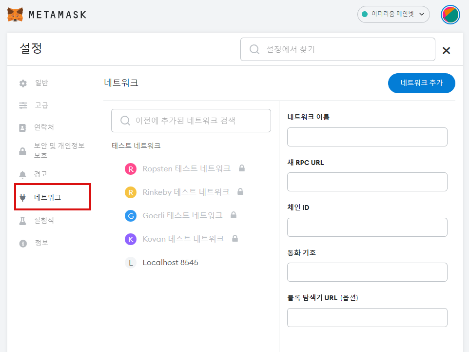

# 0⃣ 앰플 시작하기

<figure><figcaption></figcaption></figure>

## :point\_up: 지갑 만들고 앰플에 연결하기

<mark style="color:blue;">Q.</mark> 전자지갑은 무엇인가요? \
<mark style="color:red;">A.</mark> 우리가 주머니에 넣고 다니는 지갑이 아니라 온라인에서 저장할 수 있는 나만의 저장소입니다. 전자지갑은 다양한 종류가 있습니다. 앰플에서 지원하는 전자지갑은 메타마스크 등입니다.

<mark style="color:blue;">Q.</mark> 전자지갑이 필요한 이유는 무엇인가요? \
<mark style="color:red;">A.</mark> 암호화폐가 들어있는 전자지갑을 연결해야 앰플의 모든 기능을 사용할 수 있습니다.

<mark style="color:blue;">Q.</mark> 메타마스크 지은 신뢰 할 수 있나요? \
<mark style="color:red;">A.</mark> 메타마스크 지갑은 Web3 앱을 위한 최고의  암호화폐 지갑으로 불리고 있습니다.

<mark style="color:blue;">Q.</mark> 메타마스크 지갑 생성은 어떻게 하나요? \
<mark style="color:red;">A.</mark> 크롬 및 파이어폭스에서 메타마스크를 다운로드할 수 있으며, 모바일 사용자의 경우 iOS 및 안드로이드 버전을 사용할 수 있습니다. 메타마스크 [다운로드 페이지](https://metamask.io/download.html)로 이동하여 플랫폼을 선택하고, 기기의 설치 방법을 따르면 됩니다. 지갑 생성(Create a Wallet)을 클릭하고 시드 문구를 안전한 곳에 적어두세요.(인터넷에 연결된 장치에는 보관하지 않는 게 좋습니다.)해당 문구가 없으면 기기가 고장 나거나 기기를 분실할 경우, 자금을 복구할 수 없습니다.

<mark style="color:blue;">Q.</mark> 앰플에서 사용하기 위해 전자 지갑 설정을 어떻게 해야 하나요?\
<mark style="color:red;">A.</mark> 드롭다운 메뉴에서 설정을 선택합니다.

<figure><figcaption></figcaption></figure>

설정 페이지에서 네트워크(Networks) 메뉴로 이동합니다.

<figure><figcaption></figcaption></figure>

또는 우 상단의 네트워크 추가(Add Network)를 클릭하고 수동으로 폴리곤 체인을 추가해야 합니다. 네트워크를 위해 입력해야 하는 매개 변수는 아래와 같습니다.&#x20;

<figure><figcaption></figcaption></figure>

**Network Name:** Polygon Mainnet\
**New RPC URL:** [https://polygon-rpc.com/](https://polygon-rpc.com/)\
**ChainID:** 137\
**Symbol:** MATIC\
**Block Explorer URL:** [https://polygonscan.com](https://polygonscan.com)

<figure><figcaption>
다음과 같이 입력해주세요
</figcaption></figure>

<figure><figcaption>
폴리곤 체인 추가가 완료되었습니다!
</figcaption></figure>

## :point\_up: 앰플로 자금 이체하기

내용+스샷

